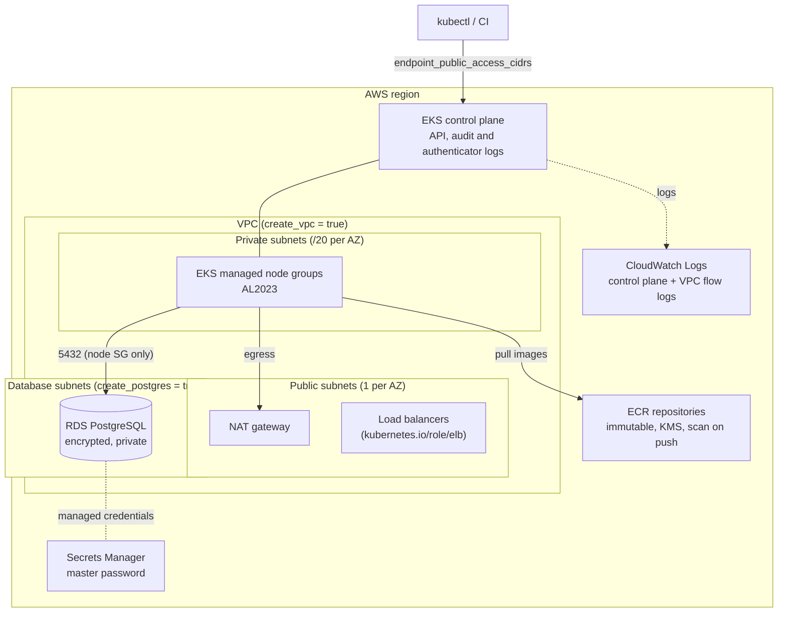

# eks-terraform-iac

**A production-minded Terraform module that ships an Amazon EKS cluster, its VPC, ECR repositories and an optional private PostgreSQL database in a single `module` block.**

[](https://github.com/Sudo-oy/eks-terraform-iac/actions/workflows/ci.yml)
[](LICENSE)
[](https://developer.hashicorp.com/terraform)
[](https://registry.terraform.io/providers/hashicorp/aws/latest)
[](https://www.checkov.io/)

## Features

- **EKS in one block**: control plane, managed node groups (AL2023), core add-ons (VPC CNI, CoreDNS, kube-proxy, Pod Identity Agent) and EKS access entries. Built on the battle-tested [`terraform-aws-modules/eks`](https://registry.terraform.io/modules/terraform-aws-modules/eks/aws) v21.
- **Networking included or bring your own**: a 2 or 3 AZ VPC with private, public and database subnets, NAT, flow logs and subnet tags for the AWS Load Balancer Controller and Karpenter. Or plug in an existing VPC with `create_vpc = false`.
- **Secure defaults**: private worker nodes, control plane audit logs, immutable KMS-encrypted ECR repositories with scan-on-push and lifecycle policies.
- **Optional PostgreSQL**: private, encrypted RDS instance reachable only from the nodes. The master password is **managed by AWS Secrets Manager**, so it never appears in code or state. IAM authentication, Enhanced Monitoring, slow query logging, backups and deletion protection are on by default.
- **Typed and validated inputs**: every variable is typed, documented and guarded by validation rules.
- **Tested without an AWS account**: `terraform test` runs plan-level assertions against a mocked AWS provider.
- **CI quality gates**: `terraform fmt`, `validate`, `tflint`, `terraform test`, `checkov`, `gitleaks` and a docs drift check.

## Architecture



## Quick start

Deploy the [basic example](examples/basic) (an EKS cluster, one ECR repository and PostgreSQL) with your AWS credentials loaded:

```bash
git clone https://github.com/Sudo-oy/eks-terraform-iac.git && cd eks-terraform-iac/examples/basic
terraform init
terraform apply
```

Then run the command printed in the `kubeconfig_command` output and `kubectl get nodes`.

> **Cost warning**: this creates billable resources (EKS control plane, NAT gateway, EC2 nodes, RDS). Run `terraform destroy` when you are done.

## Usage

```hcl
module "eks" {
  source = "github.com/Sudo-oy/eks-terraform-iac?ref=v0.1.0"

  name               = "platform-dev"
  kubernetes_version = "1.34"

  endpoint_public_access_cidrs = ["203.0.113.0/24"]

  node_groups = {
    general = {
      instance_types = ["m6i.large"]
      min_size       = 2
      desired_size   = 2
      max_size       = 6
    }
    spot = {
      instance_types = ["m6i.large", "m5.large"]
      capacity_type  = "SPOT"
      labels         = { workload = "batch" }
    }
  }

  ecr_repositories = ["api", "worker"]
  create_postgres  = true

  tags = {
    team = "platform"
  }
}
```

Using an existing VPC:

```hcl
module "eks" {
  source = "github.com/Sudo-oy/eks-terraform-iac?ref=v0.1.0"

  name               = "platform-prod"
  create_vpc         = false
  vpc_id             = "vpc-0123456789abcdef0"
  private_subnet_ids = ["subnet-aaa", "subnet-bbb", "subnet-ccc"]
}
```

## Configuration

Configure AWS credentials the usual way (`AWS_PROFILE`, SSO or environment variables). See [`.env.example`](.env.example). The module never needs a secret as an input.

<!-- BEGIN_TF_DOCS -->
### Requirements

| Name | Version |
| ---- | ------- |
| <a name="requirement_terraform"></a> [terraform](#requirement\_terraform) | >= 1.9.0 |
| <a name="requirement_aws"></a> [aws](#requirement\_aws) | >= 6.59, < 7.0 |

### Providers

| Name | Version |
| ---- | ------- |
| <a name="provider_aws"></a> [aws](#provider\_aws) | >= 6.59, < 7.0 |

### Modules

| Name | Source | Version |
| ---- | ------ | ------- |
| <a name="module_eks"></a> [eks](#module\_eks) | terraform-aws-modules/eks/aws | 21.25.0 |
| <a name="module_vpc"></a> [vpc](#module\_vpc) | terraform-aws-modules/vpc/aws | 6.7.2 |

### Resources

| Name | Type |
| ---- | ---- |
| [aws_db_instance.postgres](https://registry.terraform.io/providers/hashicorp/aws/latest/docs/resources/db_instance) | resource |
| [aws_db_parameter_group.postgres](https://registry.terraform.io/providers/hashicorp/aws/latest/docs/resources/db_parameter_group) | resource |
| [aws_db_subnet_group.postgres](https://registry.terraform.io/providers/hashicorp/aws/latest/docs/resources/db_subnet_group) | resource |
| [aws_ecr_lifecycle_policy.this](https://registry.terraform.io/providers/hashicorp/aws/latest/docs/resources/ecr_lifecycle_policy) | resource |
| [aws_ecr_repository.this](https://registry.terraform.io/providers/hashicorp/aws/latest/docs/resources/ecr_repository) | resource |
| [aws_iam_role.rds_monitoring](https://registry.terraform.io/providers/hashicorp/aws/latest/docs/resources/iam_role) | resource |
| [aws_iam_role_policy_attachment.rds_monitoring](https://registry.terraform.io/providers/hashicorp/aws/latest/docs/resources/iam_role_policy_attachment) | resource |
| [aws_security_group.postgres](https://registry.terraform.io/providers/hashicorp/aws/latest/docs/resources/security_group) | resource |
| [aws_vpc_security_group_ingress_rule.postgres_from_nodes](https://registry.terraform.io/providers/hashicorp/aws/latest/docs/resources/vpc_security_group_ingress_rule) | resource |

### Inputs

| Name | Description | Type | Default | Required |
| ---- | ----------- | ---- | ------- | :------: |
| <a name="input_access_entries"></a> [access\_entries](#input\_access\_entries) | Additional EKS access entries, passed as-is to the `access_entries` input of terraform-aws-modules/eks. | `any` | `{}` | no |
| <a name="input_az_count"></a> [az\_count](#input\_az\_count) | Number of availability zones used by the VPC created by the module. | `number` | `3` | no |
| <a name="input_cluster_enabled_log_types"></a> [cluster\_enabled\_log\_types](#input\_cluster\_enabled\_log\_types) | Control plane log types sent to CloudWatch Logs. | `list(string)` | <pre>[<br/>  "api",<br/>  "audit",<br/>  "authenticator"<br/>]</pre> | no |
| <a name="input_create_postgres"></a> [create\_postgres](#input\_create\_postgres) | Create a private Amazon RDS for PostgreSQL instance reachable from the EKS nodes. | `bool` | `false` | no |
| <a name="input_create_vpc"></a> [create\_vpc](#input\_create\_vpc) | Create a dedicated VPC. Set to false to deploy into an existing VPC (`vpc_id` and `private_subnet_ids` are then required). | `bool` | `true` | no |
| <a name="input_database_subnet_ids"></a> [database\_subnet\_ids](#input\_database\_subnet\_ids) | IDs of existing subnets for the PostgreSQL subnet group. Required when `create_vpc` is false and `create_postgres` is true. | `list(string)` | `[]` | no |
| <a name="input_ecr_force_delete"></a> [ecr\_force\_delete](#input\_ecr\_force\_delete) | Allow Terraform to delete ECR repositories that still contain images. | `bool` | `false` | no |
| <a name="input_ecr_image_tag_mutability"></a> [ecr\_image\_tag\_mutability](#input\_ecr\_image\_tag\_mutability) | Tag mutability of the ECR repositories. | `string` | `"IMMUTABLE"` | no |
| <a name="input_ecr_kms_key_arn"></a> [ecr\_kms\_key\_arn](#input\_ecr\_kms\_key\_arn) | ARN of a customer managed KMS key for ECR encryption. `null` uses the AWS managed key. | `string` | `null` | no |
| <a name="input_ecr_max_image_count"></a> [ecr\_max\_image\_count](#input\_ecr\_max\_image\_count) | Number of images kept per ECR repository. Older images are expired by a lifecycle policy. | `number` | `30` | no |
| <a name="input_ecr_repositories"></a> [ecr\_repositories](#input\_ecr\_repositories) | Names of the ECR repositories to create. Empty list: no repository. | `list(string)` | `[]` | no |
| <a name="input_enable_cluster_creator_admin_permissions"></a> [enable\_cluster\_creator\_admin\_permissions](#input\_enable\_cluster\_creator\_admin\_permissions) | Grant cluster-admin to the IAM identity that runs Terraform, through an EKS access entry. | `bool` | `true` | no |
| <a name="input_enable_vpc_flow_logs"></a> [enable\_vpc\_flow\_logs](#input\_enable\_vpc\_flow\_logs) | Send VPC flow logs to CloudWatch Logs. Ignored when `create_vpc` is false. | `bool` | `true` | no |
| <a name="input_endpoint_public_access"></a> [endpoint\_public\_access](#input\_endpoint\_public\_access) | Expose the Kubernetes API server endpoint publicly. The private endpoint is always enabled. | `bool` | `true` | no |
| <a name="input_endpoint_public_access_cidrs"></a> [endpoint\_public\_access\_cidrs](#input\_endpoint\_public\_access\_cidrs) | CIDR blocks allowed to reach the public API endpoint. Restrict this to your office or VPN ranges in production. | `list(string)` | <pre>[<br/>  "0.0.0.0/0"<br/>]</pre> | no |
| <a name="input_kubernetes_version"></a> [kubernetes\_version](#input\_kubernetes\_version) | Kubernetes version of the EKS control plane (for example `1.34`). | `string` | `"1.34"` | no |
| <a name="input_log_retention_in_days"></a> [log\_retention\_in\_days](#input\_log\_retention\_in\_days) | Retention (in days) of the CloudWatch log groups created for the control plane and VPC flow logs. | `number` | `90` | no |
| <a name="input_name"></a> [name](#input\_name) | Name of the EKS cluster. Also used as a prefix for every resource created by the module. | `string` | n/a | yes |
| <a name="input_node_groups"></a> [node\_groups](#input\_node\_groups) | EKS managed node groups, keyed by name. Every attribute is optional. | <pre>map(object({<br/>    ami_type       = optional(string, "AL2023_x86_64_STANDARD")<br/>    instance_types = optional(list(string), ["t3.medium"])<br/>    capacity_type  = optional(string, "ON_DEMAND")<br/>    min_size       = optional(number, 1)<br/>    max_size       = optional(number, 3)<br/>    desired_size   = optional(number, 2)<br/>    labels         = optional(map(string), {})<br/>  }))</pre> | <pre>{<br/>  "default": {}<br/>}</pre> | no |
| <a name="input_postgres_allocated_storage"></a> [postgres\_allocated\_storage](#input\_postgres\_allocated\_storage) | Initial storage (GiB). | `number` | `20` | no |
| <a name="input_postgres_backup_retention_period"></a> [postgres\_backup\_retention\_period](#input\_postgres\_backup\_retention\_period) | Number of days automated backups are kept. | `number` | `7` | no |
| <a name="input_postgres_db_name"></a> [postgres\_db\_name](#input\_postgres\_db\_name) | Name of the database created on the instance. | `string` | `"app"` | no |
| <a name="input_postgres_deletion_protection"></a> [postgres\_deletion\_protection](#input\_postgres\_deletion\_protection) | Enable deletion protection and take a final snapshot on destroy. Disable it for ephemeral environments. | `bool` | `true` | no |
| <a name="input_postgres_engine_version"></a> [postgres\_engine\_version](#input\_postgres\_engine\_version) | PostgreSQL engine version (major, or major.minor). | `string` | `"17"` | no |
| <a name="input_postgres_instance_class"></a> [postgres\_instance\_class](#input\_postgres\_instance\_class) | RDS instance class. | `string` | `"db.t4g.small"` | no |
| <a name="input_postgres_kms_key_arn"></a> [postgres\_kms\_key\_arn](#input\_postgres\_kms\_key\_arn) | ARN of a customer managed KMS key for storage and Performance Insights encryption. `null` uses the AWS managed key. | `string` | `null` | no |
| <a name="input_postgres_log_min_duration_ms"></a> [postgres\_log\_min\_duration\_ms](#input\_postgres\_log\_min\_duration\_ms) | Log statements running longer than this many milliseconds (-1 disables slow query logging). | `number` | `1000` | no |
| <a name="input_postgres_max_allocated_storage"></a> [postgres\_max\_allocated\_storage](#input\_postgres\_max\_allocated\_storage) | Upper limit (GiB) for storage autoscaling. Set it equal to `postgres_allocated_storage` to disable autoscaling. | `number` | `100` | no |
| <a name="input_postgres_monitoring_interval"></a> [postgres\_monitoring\_interval](#input\_postgres\_monitoring\_interval) | Enhanced Monitoring interval in seconds. 0 disables Enhanced Monitoring. | `number` | `60` | no |
| <a name="input_postgres_multi_az"></a> [postgres\_multi\_az](#input\_postgres\_multi\_az) | Deploy a standby replica in another availability zone. | `bool` | `false` | no |
| <a name="input_postgres_performance_insights_enabled"></a> [postgres\_performance\_insights\_enabled](#input\_postgres\_performance\_insights\_enabled) | Enable Performance Insights (not supported on every instance class). | `bool` | `false` | no |
| <a name="input_postgres_username"></a> [postgres\_username](#input\_postgres\_username) | Master user name. The password is generated and stored in AWS Secrets Manager. | `string` | `"app_admin"` | no |
| <a name="input_private_subnet_ids"></a> [private\_subnet\_ids](#input\_private\_subnet\_ids) | IDs of existing private subnets (at least two AZs) for the control plane ENIs and the nodes. Required when `create_vpc` is false. | `list(string)` | `[]` | no |
| <a name="input_single_nat_gateway"></a> [single\_nat\_gateway](#input\_single\_nat\_gateway) | Use one shared NAT gateway instead of one per availability zone. Cheaper, but not highly available. | `bool` | `true` | no |
| <a name="input_tags"></a> [tags](#input\_tags) | Tags applied to every resource created by the module. | `map(string)` | `{}` | no |
| <a name="input_vpc_cidr"></a> [vpc\_cidr](#input\_vpc\_cidr) | IPv4 CIDR block of the VPC created by the module (prefix between /16 and /20). Ignored when `create_vpc` is false. | `string` | `"10.0.0.0/16"` | no |
| <a name="input_vpc_id"></a> [vpc\_id](#input\_vpc\_id) | ID of an existing VPC. Required when `create_vpc` is false. | `string` | `null` | no |

### Outputs

| Name | Description |
| ---- | ----------- |
| <a name="output_cluster_arn"></a> [cluster\_arn](#output\_cluster\_arn) | ARN of the EKS cluster. |
| <a name="output_cluster_certificate_authority_data"></a> [cluster\_certificate\_authority\_data](#output\_cluster\_certificate\_authority\_data) | Base64-encoded certificate data required to communicate with the cluster. |
| <a name="output_cluster_endpoint"></a> [cluster\_endpoint](#output\_cluster\_endpoint) | Endpoint of the Kubernetes API server. |
| <a name="output_cluster_name"></a> [cluster\_name](#output\_cluster\_name) | Name of the EKS cluster. |
| <a name="output_cluster_oidc_issuer_url"></a> [cluster\_oidc\_issuer\_url](#output\_cluster\_oidc\_issuer\_url) | OpenID Connect issuer URL of the cluster. |
| <a name="output_cluster_security_group_id"></a> [cluster\_security\_group\_id](#output\_cluster\_security\_group\_id) | ID of the cluster security group. |
| <a name="output_ecr_repository_urls"></a> [ecr\_repository\_urls](#output\_ecr\_repository\_urls) | Map of ECR repository name to repository URL. |
| <a name="output_kubeconfig_command"></a> [kubeconfig\_command](#output\_kubeconfig\_command) | AWS CLI command that writes a kubeconfig entry for the cluster. |
| <a name="output_node_security_group_id"></a> [node\_security\_group\_id](#output\_node\_security\_group\_id) | ID of the node shared security group. |
| <a name="output_oidc_provider_arn"></a> [oidc\_provider\_arn](#output\_oidc\_provider\_arn) | ARN of the IAM OIDC provider (for IRSA). |
| <a name="output_postgres_endpoint"></a> [postgres\_endpoint](#output\_postgres\_endpoint) | Hostname of the PostgreSQL instance (null when `create_postgres` is false). |
| <a name="output_postgres_master_user_secret_arn"></a> [postgres\_master\_user\_secret\_arn](#output\_postgres\_master\_user\_secret\_arn) | ARN of the Secrets Manager secret holding the master credentials (null when `create_postgres` is false). |
| <a name="output_postgres_port"></a> [postgres\_port](#output\_postgres\_port) | Port of the PostgreSQL instance (null when `create_postgres` is false). |
| <a name="output_private_subnet_ids"></a> [private\_subnet\_ids](#output\_private\_subnet\_ids) | IDs of the private subnets used by the cluster. |
| <a name="output_public_subnet_ids"></a> [public\_subnet\_ids](#output\_public\_subnet\_ids) | IDs of the public subnets (empty when `create_vpc` is false). |
| <a name="output_vpc_id"></a> [vpc\_id](#output\_vpc\_id) | ID of the VPC hosting the cluster. |
<!-- END_TF_DOCS -->

## Development

```bash
terraform fmt -recursive
terraform init -backend=false && terraform validate
terraform test                      # plan-level tests with a mocked AWS provider
tflint --init && tflint --recursive --config "$(pwd)/.tflint.hcl"
checkov -d . --config-file .checkov.yaml
terraform-docs .                    # regenerate the Configuration section
```

## Roadmap

- [ ] Publish to the Terraform Registry under a `terraform-aws-<name>` repository name
- [ ] `examples/complete`: existing VPC, Spot node group, access entries
- [ ] Optional EKS Auto Mode and Karpenter sub-module
- [ ] Optional add-ons: AWS Load Balancer Controller, ExternalDNS, cert-manager (Pod Identity)
- [ ] IPv6 / dual-stack VPC support
- [ ] Integration test workflow (apply and destroy in a sandbox account, on demand)
- [ ] Automated releases with semantic versioning and a CHANGELOG

## Contributing

Contributions are welcome! Read [CONTRIBUTING.md](CONTRIBUTING.md) and the [Code of Conduct](CODE_OF_CONDUCT.md). Report vulnerabilities privately as described in [SECURITY.md](SECURITY.md).

## License

[Apache License 2.0](LICENSE)
